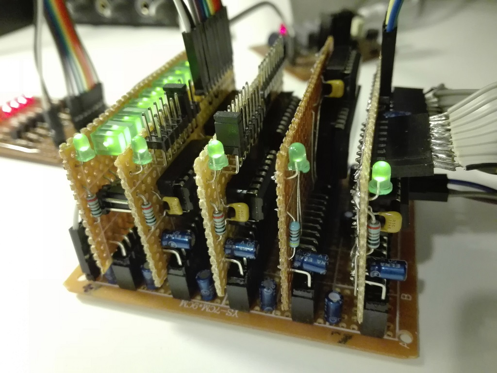

# xpSimpleBUS - A Simple BUS System eXPerience
Home didactic, I/O oriented, simple 8-bit BUS-system.

## Contents
* [system](https://github.com/gom9000/xp-bus-simplebus/tree/master/system/) containing the schematics and pcb of the xpSimpleBUS system backplane and activity-monitor hardware.
* [device](https://github.com/gom9000/xp-bus-simplebus/tree/master/device/) containing the schematics and pcb of the xpSimpleBUS devices hardware.
* [bridge](https://github.com/gom9000/xp-bus-simplebus/tree/master/bridge/) containing the schematics and pcb of the xpSimpleBUS bridges hardware to interface xpSimpleBUS to a CPU or other BUS systems.
* [expresspcb](https://github.com/gom9000/xp-bus-simplebus/tree/master/expresspcb/) containing the schematic and pcb components used for drawing the layout of xpSimpleBUS boards.

## Specifications

### BUS

* Power lines :
	* +5V
	* Gnd
* Address lines :
	* A0-A7 - 8-bit Address
* Data lines :
	* D0-D7 - 8-bit Data
* Control lines :
    * /RD - Read Operation line. "Lo" value indicates the device is being read by the CPU.
	* /WR - Write Operation line. "Lo" value indicates the device is being written by the CPU.

### I/O Address Mapping
| Addresses        | Assignment             |
|------------------|------------------------|
| n8H-nFH  n=[0,F] | Available              |
| n0H-n7H  n=[0,F] | I/O Device (AL-config) |

### Basic System Operations
System operations are signal based sequence of commands, directed to DEVICEs connected to the xpSimpleBUS, and generated by an external CPU (i.e. connected to the BUS directly or through a bridge board).

#### WRITE OPERATION
1. CPU writes and latches Address on BUS
2. CPU sets Control Line /WR
3. CPU writes Data on BUS
4. CPU unsets Control Line /WR
5. DEVICE latches Data from BUS

#### READ OPERATION
1. CPU writes and latches Address on BUS
2. CPU sets Control Line /RD
4. DEVICE writes Data on BUS
5. CPU reads Data from BUS
6. CPU unsets Control Line /RD
7. DEVICE releases BUS

### Schematics and PCB
* Schematics and PCB layouts are designed with ExpressPCB free CAD software.

## Boards

### System Boards
* **simplebus-backplane-4** - backplane with 4+1 slots.
* **simplebus-activity-monitor** - test board for bus pins activity.

### Bridge Boards
The Bridge boards are designed to interface the xpSimpleBUS system to a CPU or other kind of BUS systems.
* **simplebus-bridge-admux** - bridge board to connect the xpSimpleBUS to an external BUS with multiplexed address and data lines.

### Device Boards
#### I/O Device Boards
In order not to increase the complexity and size of the i/o pcbs, only the address pins *A0A1A2A3* are scanned to enable the device, with pin *A3* always high. Then the device responds also to addresses n0H-n7H, with n in 0..F.

* **simplebus-device-input-port** - 8-bit input port with selectable address (by a 8-jumper row) in a range of 00H-07H.
* **simplebus-device-output-port** - 8-bit latched output port with selectable address (by a 8-jumper row) in a range of 00H-07H.

#### RAM Device Boards
* **simplebus-device-sram-128bytes** - 128x8-Bytes Static RAM.

## Future Plans
* Add more xpSimpleBUS boards and specs
* Implement xpSimpleBUS based projects

## Licence
The [MIT license](https://github.com/gom9000/xp-bus-simplebus/blob/master/LICENSE/) posted in the main repository directory is applied to all the xpSimpleBUS's stuff and ExpressPCB custom components library.
You are free to use them for any purpose, just try to give credit in the documentation of your project.

## Questions/Comments
This is a home didactic project. If you have any questions, hints or comments please submit an issue with your question/hint/comment and I will get back to you as soon as I can.
