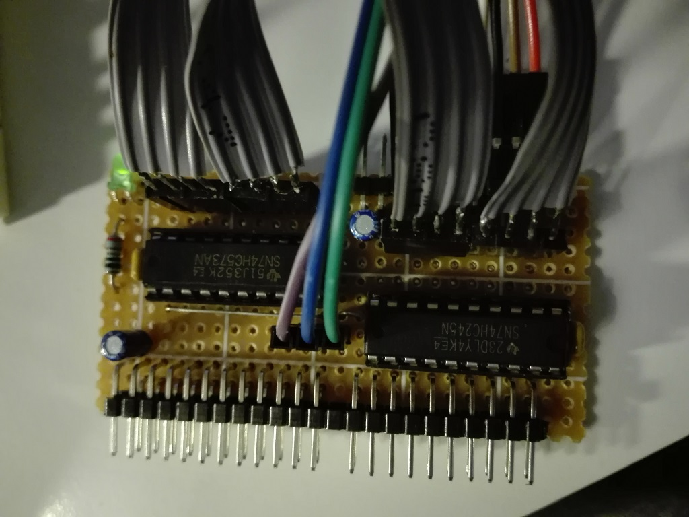

# xpSimpleBUS Bridge
Schematics and pcb of the bridges hardware to interface xpSimpleBUS to a CPU or other BUS systems.

## Boards
* **simplebus-bridge-admux** - bridge board to connect the xpSimpleBUS to an external BUS with multiplexed address and data lines.

> 
