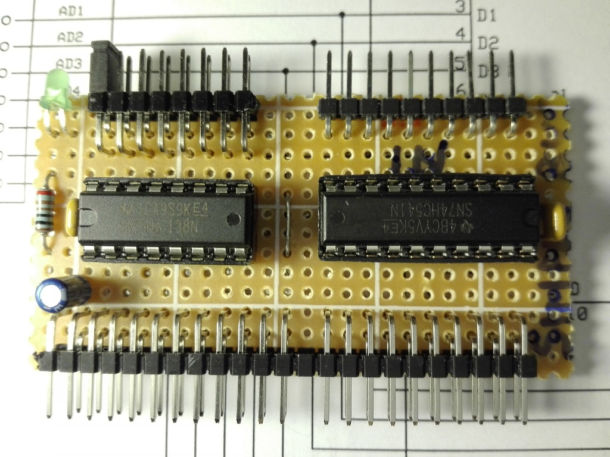
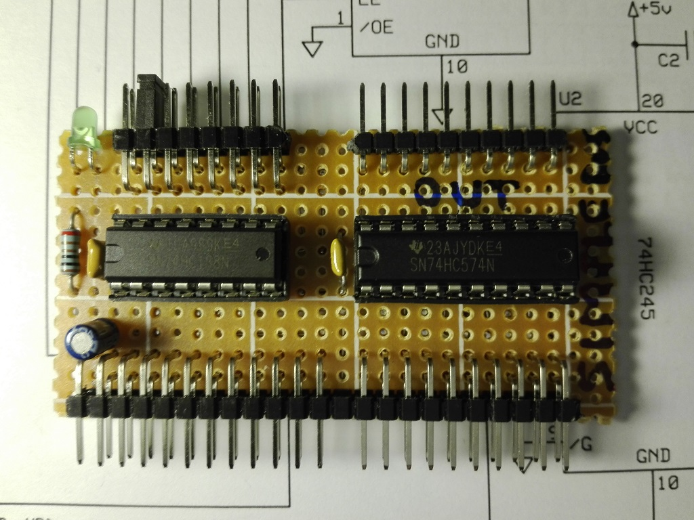
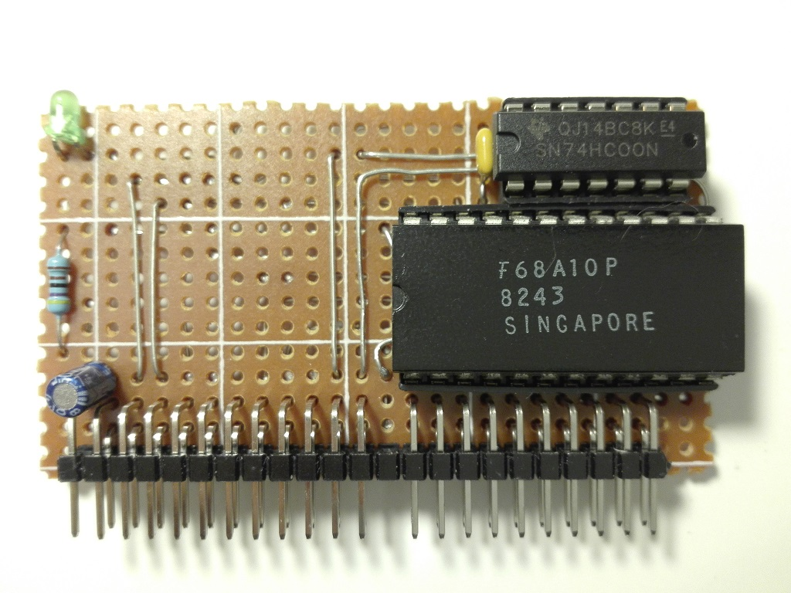

# xpSimpleBUS Device
Schematics and pcb of the xpSimpleBUS devices hardware.

## Boards
* **simplebus-device-input-port** - 8-bit input port with selectable address (by a 8-jumper row) in a range of 00H-07H.
> 

* **simplebus-device-output-port** - 8-bit latched output port with selectable address (by a 8-jumper row) in a range of 00H-07H.
> 

* **simplebus-device-sram-128bytes** - 128x8-Bytes Static RAM.
> 
