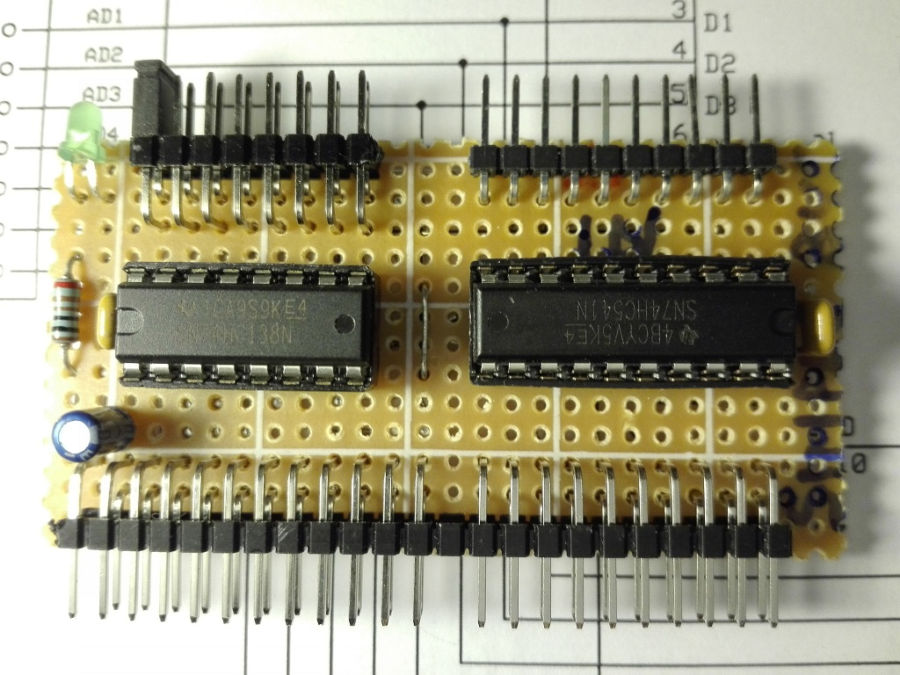
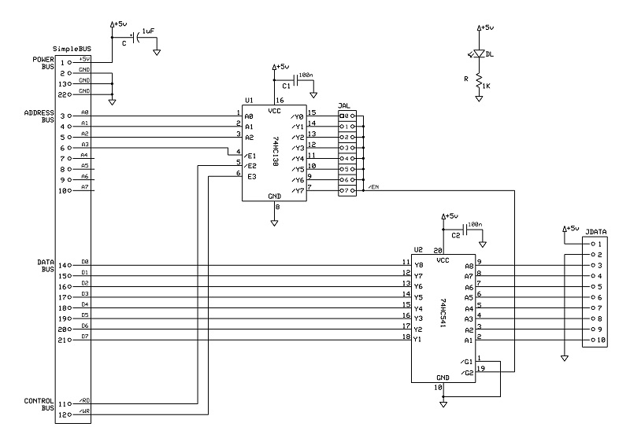
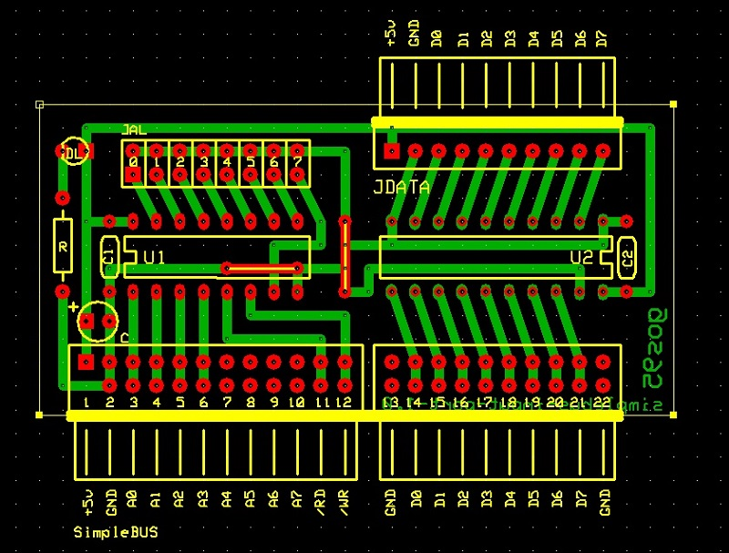

# *Input Port* Board
8-bit input port with selectable address (by a 8-jumper row) in a range of 00H-07H.

## Schematic

## PCB Layout

## Bill of Materials
- [x] paperboard 5x7cm
- [x] 1 x bulk capacitors (tantalum) 1uF 16V
- [x] power activity led green 3mm
- [x] led current limiter resistor 1Kohm
- [x] SimpleBUS DIL 24-pin right-angle header

- [x] Address-Selector DIL 16-pin header
- [x] Input-BUS SIL 10-pin header
- [x] IC-logic 74HC138, 74HC541