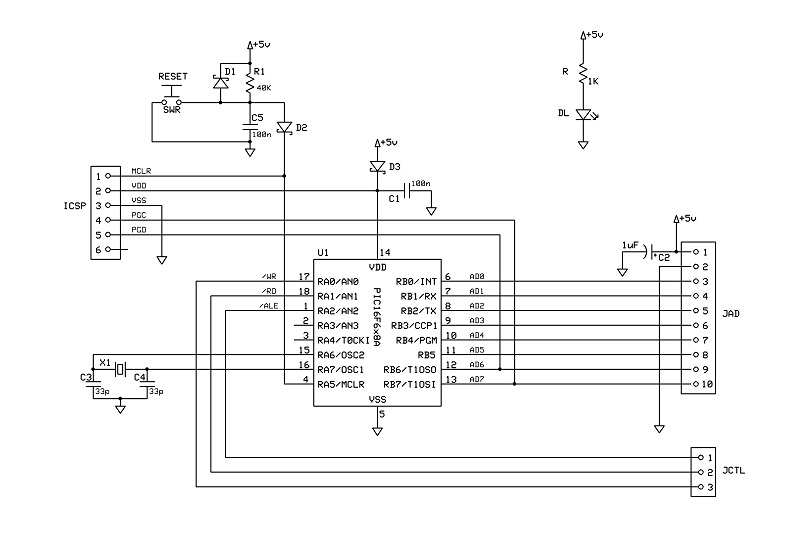

# xpSimpleBUS Interface to PIC16F6x8
Hardware to connect xpSimpleBUS to PIC16f6x8 through the *A/D Mux Bridge* board.

## Schematic

## PCB Layout

## Bill of Materials
- [x] paperboard 7x10cm
- [x] 1 x bulk capacitors (tantalum) 1uF 16V
- [x] power activity led green 3mm
- [x] led current limiter resistor 1Kohm

- [x] AD-BUS SIL 10-pin header
- [x] CTRL-BUS SIL 3-pin header
- [x] ICSP SIL 6-pin header
- [x] MCU PIC16f6x8
- [x] XTAL 4-20 MHZ
- [x] 3x small signal schottky diodes
- [x] 2x capacitor 33pF
- [x] 3x capacitor 100nF
- [x] pull-up resistor 40Kohm
- [x] reset switch NO