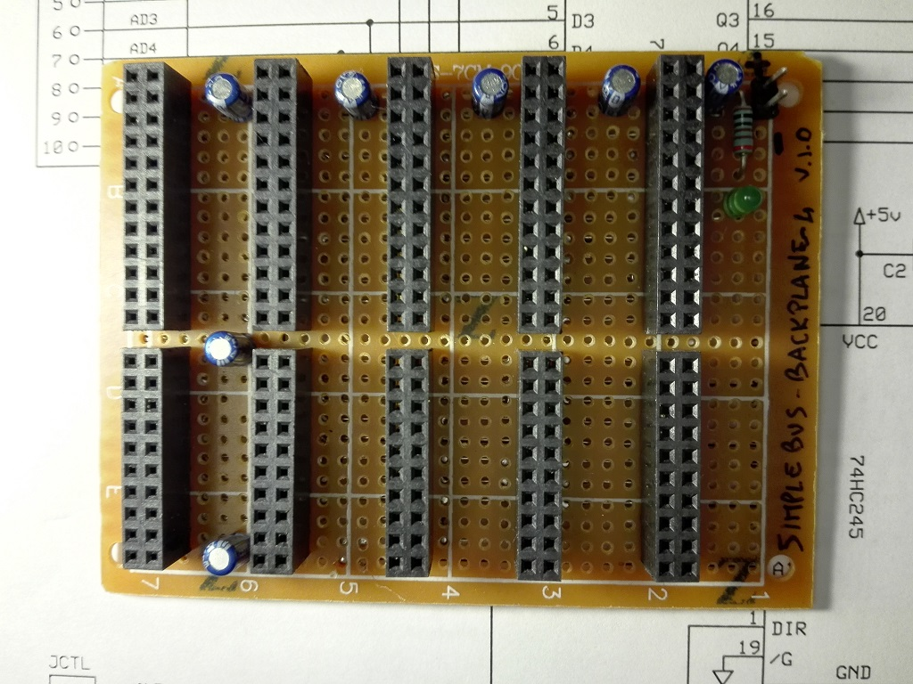
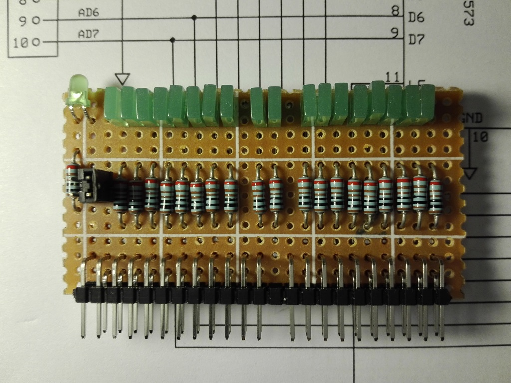

# xpSimpleBUS System
Schematics and pcb of the xpSimpleBUS system backplane and activity-monitor hardware.

## Boards
* **simplebus-backplane-4** - backplane with 4+1 slots.
> 

* **simplebus-bus-expansion** - 2-slot bus expansion.
> 

* **simplebus-activity-monitor** - test board for bus pins activity.
> 
