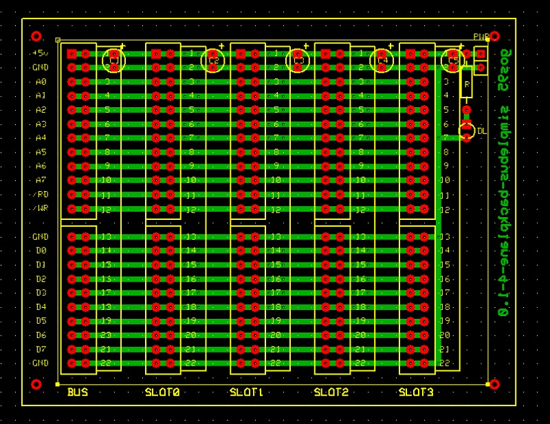

# *Backplane 4+1 slots* Board
Backplane with 4+1 slots.

## Schematic

## PCB Layout

## Bill of Materials
- [x] paperboard 7x10cm
- [x] 5 x bulk capacitors (tantalum) 1uF 16V
- [x] power activity led green 3mm
- [x] led current limiter resistor 1Kohm
- [x] 5x SimpleBUS DIL 24-pin female header

- [x] external power 2-pin header