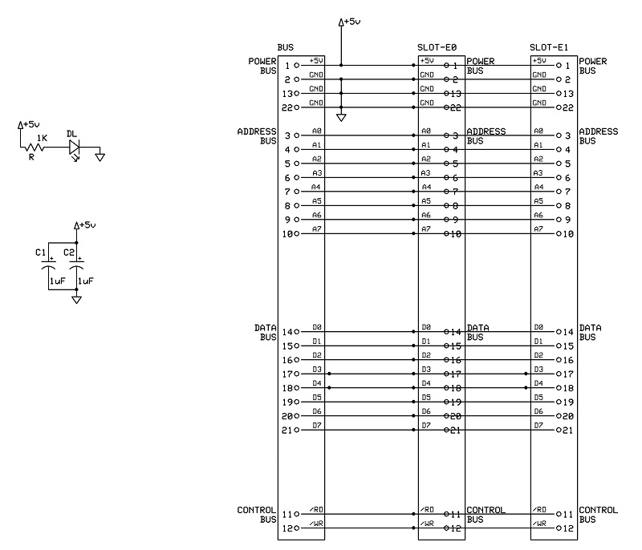
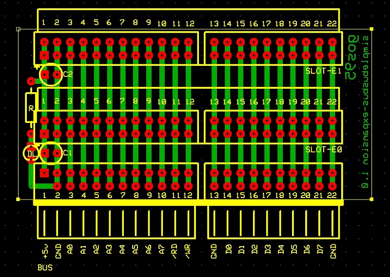

# *2-Slot BUS Expansion* Board
2-slot bus expansion.

## Schematic

## PCB Layout

## Bill of Materials
- [x] paperboard 5x7cm
- [x] 2 x bulk capacitors (tantalum) 1uF 16V
- [x] power activity led green 3mm
- [x] led current limiter resistor 1Kohm
- [x] SimpleBUS DIL 24-pin right-angle header